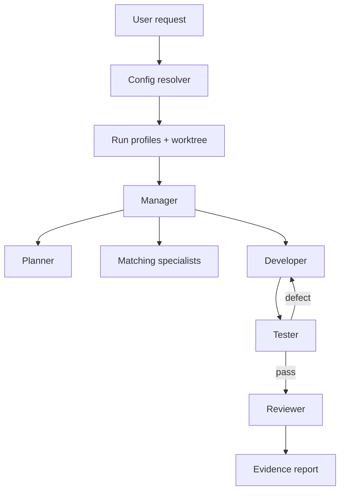
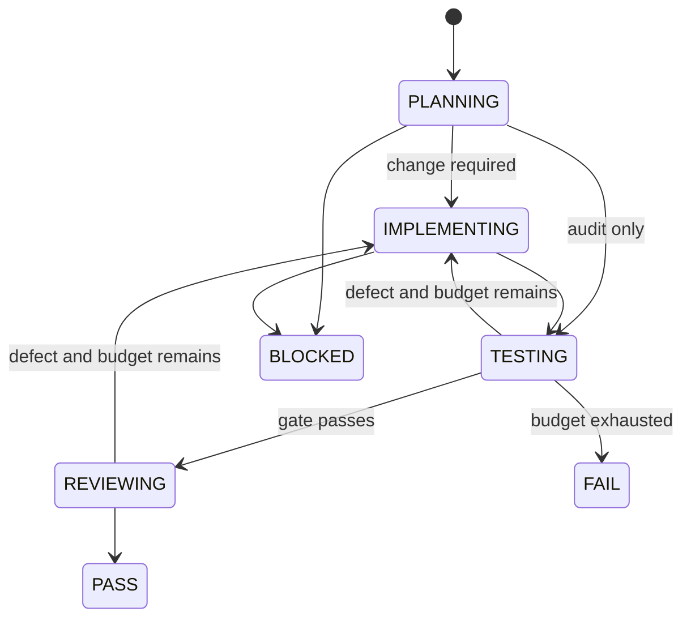

# Architecture

AutoAgent v0.2.0 是 CAO 之上一层薄而可审计的控制面。控制器负责配置合并、运行隔离、profile 生成与启动；Manager 负责动态编排；专业 worker 负责实际分析、实施与证据门。

MiniMax Challenger 在 CAO 启动前对原始需求做一次有边界的质疑。它的输出是不可信建议数据，Planner 必须用仓库和需求独立验证。Antigravity 不在自动运行图中，只能由用户在官方产品内手动使用。

## 配置解析

`lib/autoagent_config.py` 使用无第三方依赖的 Python 3.10+ 实现：

1. 选择内置 preset；
2. 合并全局配置；
3. 合并项目配置；
4. 应用单次 preset 与 `--set`；
5. 校验角色、provider、mode、专家和凭据禁止规则；
6. 写入本次 `effective-config.json`；
7. 从受版本控制的角色模板生成本次 CAO profiles 和 manifest。

生成的 profile 名包含 run-id，避免同时运行两组不同模型时相互覆盖。`custom` provider 不重写 profile，而是引用用户已安装的 CAO profile。

## 运行职责

- `bin/autoagent` 检查主机与生效 provider，建立运行目录、分支和 worktree，生成 profiles，再异步启动 Manager。
- CAO 提供 provider adapter、session、tmux、委派、消息和本地 Web UI。
- Manager 只能使用启动消息中的精确 profile map；不能自行替换供应商或模型。
- Manager 先分类 `implementation`、`audit` 或 `mixed`，并按任务性质跳过不必要的 Developer。
- `handoff.schema.json` 定义角色工作包；`gate-result.schema.json` 定义有限 verdict 与证据要求。
- Git worktree 隔离每次运行。AutoAgent 不自动删除 worktree。

## 状态与展示

Manager 在每次状态转换前后更新 `status.json`，并在 `events.jsonl` 追加事件。`autoagent status` 是快照，`autoagent watch` 每 2 秒显示阶段、活跃角色、轮次和最近事件。它不显示没有证据的伪百分比。

## 为什么拆开角色

Manager 不编码、不自测，这样实施疑问有固定的升级路径，测试证据独立，也避免模型用自己的断言批准自己。Planner 和 Reviewer 可以使用同一个供应商，但它们是不同 session、不同职责的只读角色。

额外 specialist 必须同时描述 `purpose` 和 `when`。Manager 只在条件匹配时向它提交有边界的问题，并保留最终决策权。

## 信任边界

Claude 工具限制与 Codex 沙箱提供可执行的边界。Cursor CLI 的 CAO 集成当前会自动批准工具；profile prompt 和 worktree 是护栏，不是硬 OS 沙箱。

v0.2 的配置不存储凭据，也不实施隐式模型 fallback。后续完整版可增加容器化 worker、控制器端强 schema 门、checkpoint/replay 和显式人工审批 API。
