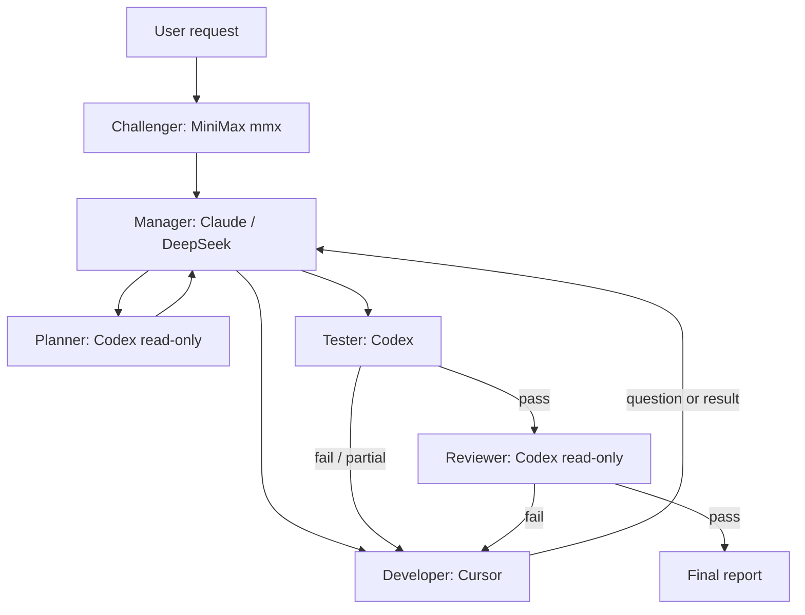

# Architecture

AutoAgent v0.1.1 is a thin, inspectable control layer over CAO. It deliberately keeps provider choice in profiles and coordination data in versioned contracts.

## Runtime responsibilities

- `bin/autoagent` validates the host, creates a run directory and isolated Git worktree, starts CAO, and launches the manager asynchronously.
- Before CAO starts, `mmx text chat` performs a requirement-only challenge pass. Its output is persisted and explicitly treated as untrusted advisory data.
- CAO provides sessions, provider adapters, tmux control, delegation, messaging, and the local Web UI.
- Profiles define role/provider/tool boundaries and the state-machine prompts.
- `handoff.schema.json` defines role-to-role work packages.
- `gate-result.schema.json` defines finite verdicts and evidence requirements.
- Git worktrees isolate each run from the user's current branch. AutoAgent never removes them automatically.

## Run states

`CREATED → PLANNING → IMPLEMENTING ↔ TESTING → REVIEWING → PASS`

Any state can transition to `BLOCKED` for an owner decision. Exhausted iteration budget or a hard failure transitions to `FAIL`. `autoagent stop` is an operator interruption; it preserves all state for replay or manual inspection.

## Why the roles are split

The manager is intentionally not the developer or tester. This keeps implementation questions routable, makes test evidence independent, and prevents a model from approving its own unsupported claim. Planner and reviewer share a read-only Codex sandbox but are separate sessions and responsibilities.

MiniMax is deliberately outside the CAO session graph in v0.1.1. CAO has no native `mmx` provider, while the official `mmx` command is a non-interactive text and media CLI rather than an interactive coding-agent TUI. AutoAgent therefore uses it for one bounded Challenger pass instead of claiming unsupported worker messaging.

## Provider replacement

The loop contract uses role names, handoffs, and gates rather than vendor-specific messages. Replacing a worker starts with changing its profile's `provider`, while keeping the manager protocol stable. v0.1 does not yet expose this through a friendly config command.

## Trust boundaries

Claude tool restrictions and Codex sandbox profiles provide meaningful enforcement. Cursor CLI's CAO integration currently auto-approves tools; the prompt and worktree are guardrails, not a hard OS boundary. A future complete version should add containerized workers, schema validation at the controller, dynamic specialists, checkpoint replay, and explicit human override APIs.
